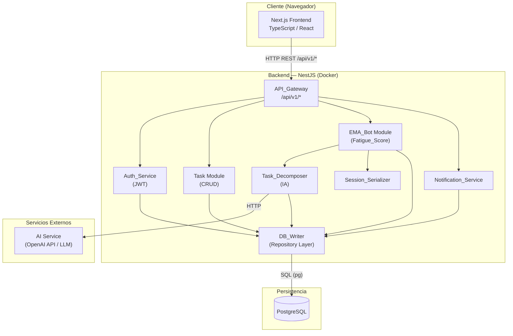
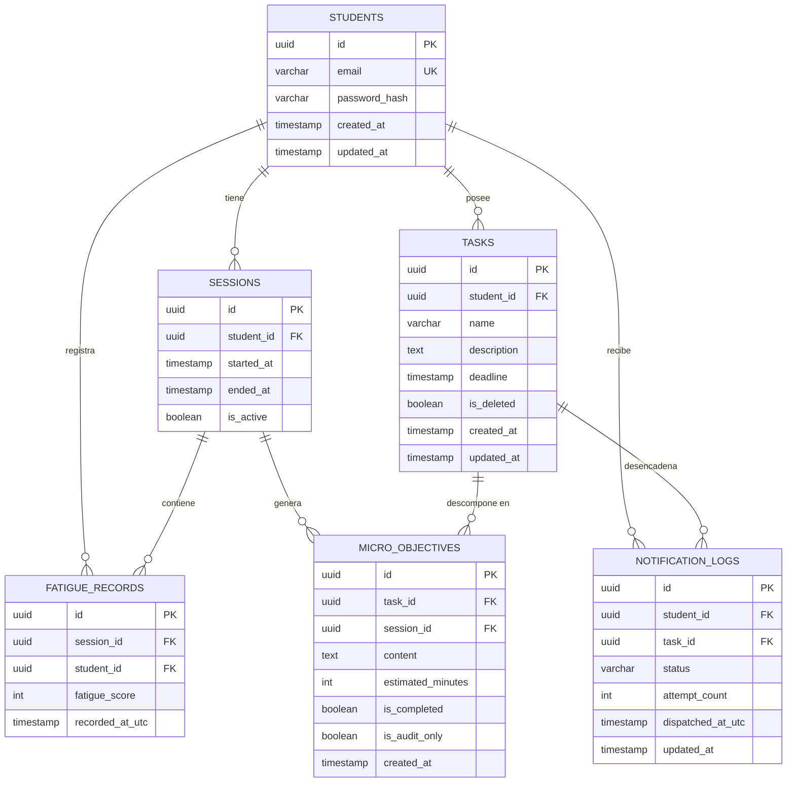
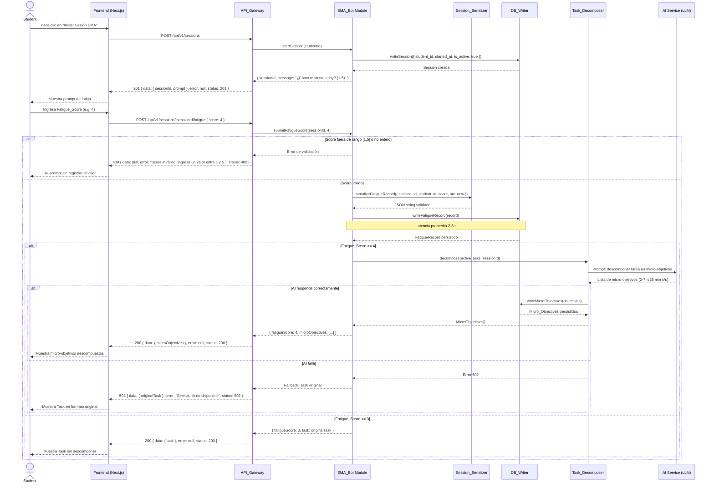
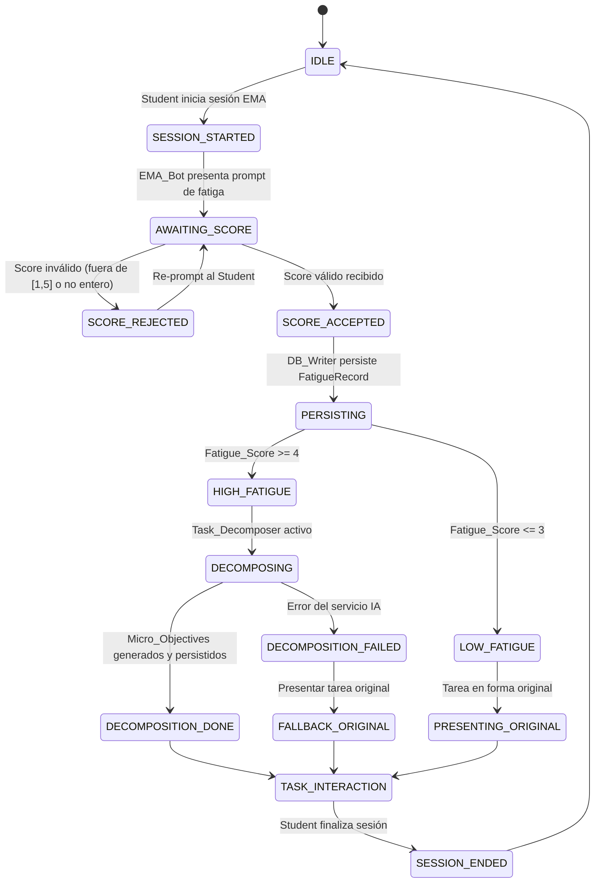

# Design Document

## Tabla de Contenidos

1. [Visión General](#1-visión-general)
2. [Comparativa NestJS vs FastAPI](#2-comparativa-nestjs-vs-fastapi)
3. [Arquitectura del Sistema](#3-arquitectura-del-sistema)
4. [Componentes e Interfaces](#4-componentes-e-interfaces)
5. [Modelo de Datos](#5-modelo-de-datos)
6. [Diseño de la API REST](#6-diseño-de-la-api-rest)
7. [Flujo del Chatbot EMA](#7-flujo-del-chatbot-ema)
8. [Estrategia de Contenedorización](#8-estrategia-de-contenedorización)
9. [Consideraciones de Seguridad](#9-consideraciones-de-seguridad)
10. [Propiedades de Correctitud](#10-propiedades-de-correctitud)
11. [Manejo de Errores](#11-manejo-de-errores)
12. [Estrategia de Pruebas](#12-estrategia-de-pruebas)
13. [Estrategia de Interfaz y UI/UX (Frontend)](#13-estrategia-de-interfaz-y-uiux-frontend)

---

## Overview

### 1. Visión General

MindFlow es una plataforma web impulsada por IA que mitiga la procrastinación académica mediante micro-interacciones adaptativas. La arquitectura sigue un modelo cliente-servidor de tres capas:

- **Frontend**: aplicación Next.js + TypeScript que sirve el Dashboard al Student.
- **Backend**: API RESTful construida con NestJS (Node.js/TypeScript), contenedorizada con Docker.
- **Base de datos**: PostgreSQL como sistema de persistencia relacional.

El flujo central es el siguiente: el Student interactúa con el EMA_Bot, que recopila el Fatigue_Score. Si la fatiga es ≥ 4, el Task_Decomposer descompone automáticamente las tareas activas en Micro_Objectives de ≤ 25 minutos. Todos los eventos se persisten en PostgreSQL a través del DB_Writer con una latencia promedio de 2-3 segundos.


---

## 2. Comparativa NestJS vs FastAPI

### Criterios de Evaluación

| Criterio | NestJS (Node.js / TypeScript) | FastAPI (Python) |
|---|---|---|
| **Coherencia con el ecosistema frontend** | ✅ Excelente. Comparte TypeScript con Next.js; los tipos de dominio (`Session`, `Task`, `Fatigue_Score`) pueden compartirse entre frontend y backend mediante paquetes npm o monorepos. | ⚠️ Moderada. El equipo necesita mantener dos lenguajes (TypeScript + Python); los tipos no se comparten directamente. |
| **Rendimiento asíncrono** | ✅ Basado en el event loop de Node.js (libuv); eficiente para I/O concurrente (conexiones DB, llamadas HTTP a servicios IA). | ✅ Excelente con `asyncio`; ligeramente superior para cargas CPU-bound gracias al GIL liberado en operaciones I/O. |
| **Ecosistema IA / ML** | ⚠️ Limitado. Integración con servicios de IA mediante HTTP (OpenAI API, etc.); no existen librerías de ML nativas comparables a Python. | ✅ Superior. Acceso nativo a PyTorch, Hugging Face, scikit-learn; ideal si el Task_Decomposer se implementa localmente. |
| **Experiencia de desarrollo** | ✅ Decoradores, inyección de dependencias, módulos: familiaridad alta para el equipo TypeScript. CLI `nest g` acelera el scaffolding. | ✅ Excelente DX con validación automática via Pydantic y documentación OpenAPI generada. Curva menor para equipos Python. |
| **Soporte comunitario** | ✅ Muy activo; >60k estrellas en GitHub; ecosistema npm maduro; documentación extensa. | ✅ Crecimiento acelerado; >70k estrellas; comunidad científica/ML muy activa. |
| **Mantenibilidad a largo plazo** | ✅ Un solo lenguaje en el stack completo facilita rotaciones de equipo, revisiones de código y CI/CD unificado. | ⚠️ Stack políglota incrementa la carga cognitiva de mantenimiento y duplica la configuración de linting, testing y type-checking. |

### Decisión y Justificación

**Recomendación: NestJS (Node.js / TypeScript)**

La razón principal es la **coherencia de ecosistema**. El frontend ya usa Next.js/TypeScript; adoptar NestJS permite:

1. Compartir interfaces y tipos de dominio entre capas mediante un monorepo (e.g., Turborepo) o paquetes `@mindflow/shared`.
2. Mantener un único flujo de CI/CD con las mismas herramientas de linting (ESLint), formateo (Prettier) y testing (Jest).
3. Reducir la carga cognitiva del equipo al operar en un solo lenguaje.

El Task_Decomposer invoca servicios de IA externos (e.g., OpenAI API) mediante HTTP, lo que elimina la necesidad de acceso nativo a librerías Python. El rendimiento asíncrono de NestJS es suficiente para los volúmenes de carga académica proyectados.

> **Acuerdo con Requisito 9.1 y 9.2** del documento de requisitos.


---

## Architecture

### 3. Arquitectura del Sistema

### Diagrama de Alto Nivel



### Descripción de Capas

| Capa | Tecnología | Responsabilidad |
|---|---|---|
| **Presentación** | Next.js 14 + TypeScript | Dashboard, formularios, gráficos de historial de fatiga |
| **API Gateway** | NestJS Guards + Interceptors | Enrutamiento, autenticación JWT, envelope de respuesta |
| **Lógica de negocio** | NestJS Services | Auth, gestión de tareas, EMA, descomposición, notificaciones |
| **Acceso a datos** | TypeORM + DB_Writer | Repositorios, queries parametrizadas, connection pool |
| **Persistencia** | PostgreSQL 15 | Almacenamiento relacional con FK constraints |
| **IA externa** | REST HTTP | Generación de Micro_Objectives via LLM |


---

## Components and Interfaces

### 4. Componentes e Interfaces

### 4.1 Auth_Service

Gestiona registro, login y validación de JWT.

```typescript
interface IAuthService {
  register(email: string, password: string): Promise<{ message: string }>;
  login(email: string, password: string): Promise<{ token: string }>;
  validateToken(token: string): Promise<StudentPayload>;
}

interface StudentPayload {
  studentId: string;
  email: string;
  iat: number;
  exp: number;
}
```

### 4.2 Task Module

CRUD de tareas académicas con aislamiento por Student.

```typescript
interface ITaskService {
  create(studentId: string, dto: CreateTaskDto): Promise<Task>;
  findAll(studentId: string): Promise<Task[]>;          // ordenadas por deadline ASC
  update(studentId: string, taskId: string, dto: UpdateTaskDto): Promise<Task>;
  softDelete(studentId: string, taskId: string): Promise<void>;
}
```

### 4.3 EMA_Bot Module

Gestiona sesiones EMA y recopila Fatigue_Score.

```typescript
interface IEMABotService {
  startSession(studentId: string): Promise<Session>;
  submitFatigueScore(sessionId: string, score: number): Promise<FatigueRecord>;
  getSessionHistory(studentId: string, limit: number): Promise<Session[]>;
}
```

### 4.4 Task_Decomposer

Descompone tareas cuando Fatigue_Score ≥ 4.

```typescript
interface ITaskDecomposer {
  shouldDecompose(fatigueScore: number): boolean;           // true si score >= 4
  decompose(task: Task, sessionId: string): Promise<MicroObjective[]>;
}
```

### 4.5 Session_Serializer

Serialización y deserialización sin pérdida de tipo.

```typescript
interface ISessionSerializer {
  serialize(session: Session): string;                      // JSON string
  deserialize(json: string): Session;
  serializeFatigueRecord(record: FatigueRecord): string;
  deserializeFatigueRecord(json: string): FatigueRecord;
}
```

### 4.6 Notification_Service

Emite recordatorios respetando límites de frecuencia y supresión de sesión activa.

```typescript
interface INotificationService {
  dispatchReminders(): Promise<void>;                       // cron job cada hora
  suppressDuringSession(studentId: string): boolean;
  getDispatchCount(studentId: string, windowHours: number): Promise<number>;
}
```

### 4.7 DB_Writer (Repository Layer)

Capa única de escritura con queries parametrizadas y connection pool.

```typescript
interface IDBWriter {
  writeSession(session: Partial<Session>): Promise<Session>;
  writeFatigueRecord(record: Partial<FatigueRecord>): Promise<FatigueRecord>;
  writeTask(task: Partial<Task>): Promise<Task>;
  writeMicroObjectives(objectives: Partial<MicroObjective>[]): Promise<MicroObjective[]>;
  writeNotificationLog(log: Partial<NotificationLog>): Promise<NotificationLog>;
}
```


---

## Correctness Properties

### 8. Propiedades de Corrección

*Una propiedad es una característica o comportamiento que debe mantenerse verdadero en todas las ejecuciones válidas de un sistema — esencialmente, una declaración formal sobre lo que el sistema debe hacer. Las propiedades sirven como puente entre las especificaciones legibles por humanos y las garantías de corrección verificables por máquinas.*

### Reflexión sobre Redundancias

Antes de definir las propiedades finales, se realizó una revisión de redundancias sobre el análisis de prework:

- Las propiedades de **aislamiento de datos** en Requisito 2 (2.3) y Requisito 5 (5.5) son conceptualmente similares pero operan en capas distintas (API vs. Dashboard). Se mantienen como propiedades separadas porque prueban superficies de código diferentes.
- Las propiedades de **integridad referencial** en Requisito 3 (3.5) y Requisito 7 (7.4) se combinan en una sola propiedad general de integridad referencial, ya que ambas validan el mismo invariante de la base de datos.
- Las propiedades de **round-trip** en Requisito 10 (10.1) y **idempotencia** (10.3) son distintas y se mantienen: una verifica `deserialize(serialize(x)) == x`, la otra verifica `serialize(deserialize(serialize(x))) == serialize(x)`.
- Las propiedades de **cardinalidad** (4.3) y **duración** (4.3) del Task_Decomposer se consolidan en una sola propiedad de invariantes de Micro_Objectives.

---

### Property 1: Round-Trip de Registro y Login

*Para todo* Student con correo electrónico válido y contraseña de al menos 8 caracteres, el flujo de registro seguido de inicio de sesión DEBERÁ retornar un JWT que, al ser verificado y decodificado, identifica al mismo Student sin pérdida de datos de identidad.

**Validates: Requisitos 1.1, 1.3**

---

### Property 2: Unicidad de Cuenta por Correo

*Para toda* secuencia de N intentos de registro con el mismo correo electrónico (N ≥ 2), el Auth_Service DEBERÁ crear exactamente una cuenta y rechazar todos los intentos subsecuentes con HTTP 409, independientemente del orden o la concurrencia de las solicitudes.

**Validates: Requisitos 1.2**

---

### Property 3: JWT con Expiración de 24 Horas

*Para todo* par de credenciales válidas (correo + contraseña), el JWT retornado por el Auth_Service DEBERÁ tener un campo `exp` igual a `iat + 86400` segundos (exactamente 24 horas), para cualquier combinación de usuario y momento de login.

**Validates: Requisitos 1.3**

---

### Property 4: Rechazo de Credenciales Inválidas

*Para toda* combinación de (correo, contraseña) donde al menos un campo no corresponde a una cuenta válida en el sistema, el Auth_Service DEBERÁ retornar HTTP 401 y el mensaje de error NO DEBERÁ diferenciar cuál campo específico es incorrecto.

**Validates: Requisitos 1.4**

---

### Propiedad 5: Acceso con JWT Válido vs. Rechazado con JWT Expirado

*Para todo* JWT emitido por el sistema, si el campo `exp` es mayor que el timestamp actual, el API_Gateway DEBERÁ conceder acceso a endpoints protegidos. *Para todo* JWT donde `exp` es menor o igual al timestamp actual, el API_Gateway DEBERÁ retornar HTTP 401.

**Valida: Requisitos 1.5, 1.6**

---

### Propiedad 6: Aislamiento de Tasks por Student (API)

*Para todo* par de Students distintos S1 y S2, los conjuntos de Tasks retornados por el API_Gateway para S1 y S2 respectivamente DEBERÁN ser disjuntos (sin elementos en común), independientemente del número total de Tasks en el sistema.

**Valida: Requisitos 2.3, 2.5**

---

### Propiedad 7: Ordenamiento Ascendente de Tasks por Fecha Límite

*Para toda* lista de Tasks retornada por el API_Gateway a cualquier Student, la secuencia de valores `deadline` DEBERÁ ser no decreciente (ordenamiento ascendente estable), independientemente del orden de inserción de las Tasks.

**Valida: Requisitos 2.3**

---

### Propiedad 8: Idempotencia de Eliminación Lógica

*Para toda* Task marcada como `is_deleted = true`, aplicar la operación de eliminación nuevamente DEBERÁ producir el mismo estado (`is_deleted = true`) sin errores adicionales ni cambios en otros campos de la Task o en sus Micro_Objectives asociados.

**Valida: Requisitos 2.6**

---

### Propiedad 9: Invariante de Rango del Fatigue_Score

*Para todo* valor de Fatigue_Score persistido en la tabla `fatigue_scores`, el campo `score` DEBERÁ ser un entero en el rango [1, 5]. Todo intento de persistir un valor fuera de este rango o de tipo no entero DEBERÁ ser rechazado por la capa de validación antes de llegar a la base de datos.

**Valida: Requisitos 3.2**

---

### Propiedad 10: Integridad Referencial de Metadatos de Fatigue_Score

*Para todo* registro de Fatigue_Score persistido con cualquier combinación de (student_id, session_id, score), DEBERÁN existir exactamente un Student válido y una Session válida con esos identificadores en la base de datos. Además, el registro DEBERÁ contener un campo `recorded_at` con timestamp en formato UTC.

**Valida: Requisitos 3.5, 7.4**

---

### Propiedad 11: Rechazo Exhaustivo de Fatigue_Score Fuera de Rango

*Para todo* valor enviado por un Student que sea: un número fuera de [1, 5], un número decimal, una cadena de texto, `null`, `undefined`, un booleano, o un objeto, el EMA_Bot DEBERÁ rechazarlo sin registrar ningún valor y volver a solicitar el input al Student.

**Valida: Requisitos 3.2**

---

### Propiedad 12: Umbral de Descomposición por Fatiga

*Para toda* combinación de (Task, Fatigue_Score), si `fatigueScore >= 4` entonces el Task_Decomposer DEBERÁ producir Micro_Objectives; si `fatigueScore <= 3` entonces el Task_Decomposer DEBERÁ producir exactamente 0 Micro_Objectives. La separación de comportamiento DEBERÁ valer para cualquier Task, independientemente de su longitud o complejidad.

**Valida: Requisitos 4.1, 4.2**

---

### Propiedad 13: Invariantes de Cardinalidad y Duración de Micro_Objectives

*Para toda* Task descompuesta por el Task_Decomposer bajo condición `fatigueScore >= 4`, el número de Micro_Objectives generados DEBERÁ ser un entero en el intervalo [2, 7], y la duración estimada (`estimated_minutes`) de cada Micro_Objective individual DEBERÁ ser un entero positivo menor o igual a 25.

**Valida: Requisitos 4.3**

---

### Propiedad 14: Aislamiento de Datos en el Dashboard

*Para todo* par de Students distintos S1 y S2, el conjunto de datos mostrados en el Dashboard de S1 (Tasks, Micro_Objectives, historial de fatiga) DEBERÁ ser completamente disjunto del conjunto de datos mostrados en el Dashboard de S2, sin filtración de información entre cuentas.

**Valida: Requisitos 5.1, 5.5**

---

### Propiedad 15: Consistencia Acumulativa de Actualizaciones en Dashboard

*Para toda* secuencia de N marcas de Micro_Objective como completado, la consulta al Dashboard DEBERÁ reflejar exactamente N cambios acumulados en el estado `is_completed`, sin duplicados ni pérdidas, independientemente del orden en que se procesaron las marcas.

**Valida: Requisitos 5.2**

---

### Propiedad 16: Límite de Frecuencia de Notificaciones

*Para todo* Student y cualquier ventana de 24 horas, el número total de notificaciones despachadas por el Notification_Service con estado `sent` DEBERÁ ser siempre menor o igual a 3, independientemente de cuántas Tasks tengan fechas límite próximas en ese período.

**Valida: Requisitos 6.5**

---

### Propiedad 17: Supresión de Notificaciones Durante Session Activa

*Para todo* Student que tenga una Session con `is_active = true`, el Notification_Service DEBERÁ despachar exactamente 0 notificaciones de recordatorio de fecha límite durante toda la duración activa de la Session, independientemente de cuántas Tasks elegibles existan.

**Valida: Requisitos 6.4**

---

### Propiedad 18: Registro Exhaustivo de Notificaciones

*Para toda* notificación procesada por el Notification_Service (ya sea despachada con éxito, fallida o suprimida), DEBERÁ existir exactamente un registro en la tabla `notification_logs` con un campo `dispatched_at` UTC y un campo `delivery_status` válido.

**Valida: Requisitos 6.2**

---

### Propiedad 19: Seguridad Contra Inyección SQL

*Para toda* entrada de texto arbitraria proporcionada como valor de campo en cualquier operación del DB_Writer (incluyendo payloads que contengan metacaracteres SQL como `'`, `--`, `;`, `DROP TABLE`, `UNION SELECT`), el DB_Writer DEBERÁ persistir el valor literalmente como texto sin interpretar ni ejecutar ningún metacarácter SQL como comando.

**Valida: Requisitos 7.2**

---

### Propiedad 20: Idempotencia de Reintento de Escritura

*Para toda* operación de escritura del DB_Writer que falla en el primer intento y tiene éxito en el reintento, el número total de registros creados en la base de datos DEBERÁ ser exactamente 1 (sin duplicados), independientemente del tipo de entidad (Session, Task, Fatigue_Score, Micro_Objective).

**Valida: Requisitos 7.3**

---

### Propiedad 21: Persistencia de Datos Entre Reinicios del Contenedor PostgreSQL

*Para todo* número N de reinicios consecutivos del contenedor de PostgreSQL (N ≥ 1), los datos persistidos en el volumen `mindflow_pgdata` antes del reinicio DEBERÁN ser completamente accesibles y correctos después del reinicio, sin pérdida ni corrupción de registros.

**Valida: Requisitos 8.3**

---

### Propiedad 22: Invariante de Estructura de Respuesta del API

*Para toda* respuesta retornada por el API_Gateway, independientemente del endpoint invocado, el método HTTP utilizado, o el código de estado HTTP resultante (200, 201, 400, 401, 403, 404, 409, 422, 502), el cuerpo de la respuesta DEBERÁ ser JSON válido que contenga los campos `data`, `error` y `status`.

**Valida: Requisitos 9.4, 9.5**

---

### Propiedad 23: Versionado de Rutas bajo /api/v1/

*Para todo* endpoint registrado en el API_Gateway, la ruta completa DEBERÁ comenzar con el prefijo literal `/api/v1/`, sin excepción para ningún recurso ni subrecurso del sistema.

**Valida: Requisitos 9.3**

---

### Propiedad 24: Round-Trip de Serialización de Session

*Para todo* objeto Session generado con valores válidos (cualquier combinación de campos dentro del dominio definido), la operación `deserializar(serializar(session))` DEBERÁ producir un objeto Session equivalente al original, con todos los campos preservando su valor y tipo original sin coerción implícita.

**Valida: Requisitos 10.1, 10.5**

---

### Propiedad 25: Idempotencia de Serialización de Session

*Para todo* objeto Session válido, la operación `serializar(deserializar(serializar(session)))` DEBERÁ producir una cadena JSON idéntica (carácter por carácter) a `serializar(session)`, garantizando que la serialización es estable ante aplicaciones repetidas.

**Valida: Requisitos 10.3**

---

### Propiedad 26: Preservación de Tipo Entero del Fatigue_Score en Serialización

*Para todo* valor de Fatigue_Score en el rango [1, 5], el Session_Serializer DEBERÁ producir un valor JSON de tipo `number` entero (sin punto decimal, sin comillas), nunca una cadena de texto (`"4"`) ni un número flotante (`4.0`), en cualquier objeto Session serializado.

**Valida: Requisitos 10.2**

---

### Propiedad 27: Rechazo de Payloads JSON Inválidos por Session_Serializer

*Para toda* entrada JSON que tenga campos requeridos faltantes, tipos de datos incorrectos, o valores fuera del dominio válido, el Session_Serializer DEBERÁ retornar un error de validación descriptivo sin construir ningún objeto Session parcial ni propagar un estado inconsistente.

**Valida: Requisitos 10.4**

---

## Data Models

### 5. Modelo de Datos

### Diagrama Entidad-Relación



### Descripción de Tablas

**`students`**
| Campo | Tipo | Restricciones | Descripción |
|---|---|---|---|
| `id` | `UUID` | PK, DEFAULT gen_random_uuid() | Identificador único del Student |
| `email` | `VARCHAR(255)` | NOT NULL, UNIQUE | Correo electrónico |
| `password_hash` | `VARCHAR(255)` | NOT NULL | Hash bcrypt de la contraseña |
| `created_at` | `TIMESTAMP WITH TIME ZONE` | NOT NULL, DEFAULT NOW() | Fecha de registro |
| `updated_at` | `TIMESTAMP WITH TIME ZONE` | NOT NULL, DEFAULT NOW() | Última actualización |

**`sessions`**
| Campo | Tipo | Restricciones | Descripción |
|---|---|---|---|
| `id` | `UUID` | PK | Identificador de sesión |
| `student_id` | `UUID` | FK → students.id, NOT NULL | Student propietario |
| `started_at` | `TIMESTAMP WITH TIME ZONE` | NOT NULL | Inicio de la sesión |
| `ended_at` | `TIMESTAMP WITH TIME ZONE` | NULLABLE | Fin de la sesión |
| `is_active` | `BOOLEAN` | NOT NULL, DEFAULT TRUE | Sesión activa |

**`fatigue_records`**
| Campo | Tipo | Restricciones | Descripción |
|---|---|---|---|
| `id` | `UUID` | PK | Identificador del registro |
| `session_id` | `UUID` | FK → sessions.id, NOT NULL | Sesión donde se registró |
| `student_id` | `UUID` | FK → students.id, NOT NULL | Student que reportó |
| `fatigue_score` | `SMALLINT` | NOT NULL, CHECK (1 ≤ value ≤ 5) | Puntuación de fatiga |
| `recorded_at_utc` | `TIMESTAMP WITH TIME ZONE` | NOT NULL, DEFAULT NOW() | Marca temporal UTC |

**`tasks`**
| Campo | Tipo | Restricciones | Descripción |
|---|---|---|---|
| `id` | `UUID` | PK | Identificador de tarea |
| `student_id` | `UUID` | FK → students.id, NOT NULL | Student propietario |
| `name` | `VARCHAR(255)` | NOT NULL | Nombre de la tarea |
| `description` | `TEXT` | NULLABLE | Descripción opcional |
| `deadline` | `TIMESTAMP WITH TIME ZONE` | NOT NULL | Fecha límite |
| `is_deleted` | `BOOLEAN` | NOT NULL, DEFAULT FALSE | Eliminación lógica |
| `created_at` | `TIMESTAMP WITH TIME ZONE` | NOT NULL, DEFAULT NOW() | Fecha de creación |
| `updated_at` | `TIMESTAMP WITH TIME ZONE` | NOT NULL, DEFAULT NOW() | Última actualización |

**`micro_objectives`**
| Campo | Tipo | Restricciones | Descripción |
|---|---|---|---|
| `id` | `UUID` | PK | Identificador del micro-objetivo |
| `task_id` | `UUID` | FK → tasks.id, NOT NULL | Tarea padre |
| `session_id` | `UUID` | FK → sessions.id, NOT NULL | Sesión que lo generó |
| `content` | `TEXT` | NOT NULL | Descripción del micro-objetivo |
| `estimated_minutes` | `SMALLINT` | NOT NULL, CHECK (0 < value ≤ 25) | Duración estimada |
| `is_completed` | `BOOLEAN` | NOT NULL, DEFAULT FALSE | Estado de completitud |
| `is_audit_only` | `BOOLEAN` | NOT NULL, DEFAULT FALSE | True cuando la tarea padre fue eliminada |
| `created_at` | `TIMESTAMP WITH TIME ZONE` | NOT NULL, DEFAULT NOW() | Fecha de creación |

**`notification_logs`**
| Campo | Tipo | Restricciones | Descripción |
|---|---|---|---|
| `id` | `UUID` | PK | Identificador del log |
| `student_id` | `UUID` | FK → students.id, NOT NULL | Student destinatario |
| `task_id` | `UUID` | FK → tasks.id, NOT NULL | Tarea que desencadenó la notificación |
| `status` | `VARCHAR(20)` | NOT NULL, CHECK IN ('pending','sent','failed') | Estado de entrega |
| `attempt_count` | `SMALLINT` | NOT NULL, DEFAULT 0 | Intentos realizados |
| `dispatched_at_utc` | `TIMESTAMP WITH TIME ZONE` | NOT NULL | Marca temporal UTC del despacho |
| `updated_at` | `TIMESTAMP WITH TIME ZONE` | NOT NULL, DEFAULT NOW() | Última actualización |


---

## Error Handling

### 9. Manejo de Errores

### 9.1 Categorías de Error y Códigos HTTP

| Situación | Código HTTP | Componente responsable |
|---|---|---|
| Registro con email duplicado | 409 Conflict | Auth_Service |
| Credenciales de login inválidas | 401 Unauthorized | Auth_Service |
| JWT expirado o inválido | 401 Unauthorized | API_Gateway (JWT Guard) |
| Acceso a recurso de otro Student | 403 Forbidden | API_Gateway |
| Datos de entrada inválidos (validación) | 422 Unprocessable Entity | API_Gateway (ValidationPipe) |
| Recurso no encontrado | 404 Not Found | API_Gateway |
| Fallo del servicio de IA | 502 Bad Gateway | Task_Decomposer |
| Error de conexión a la base de datos | 503 Service Unavailable | DB_Writer |
| Ruta no definida | 404 Not Found | API_Gateway (Global Exception Filter) |

### 9.2 Estrategia de Reintentos

- **DB_Writer**: Un reintento automático después de 500ms en caso de error de conexión transitorio.
- **Notification_Service**: Hasta 3 intentos de entrega. Tras el tercer fallo, la notificación se marca como `failed` y cesa el reintento.
- **Task_Decomposer**: Si el LLM externo falla, retorna HTTP 502 y el EMA_Bot presenta la Task original como fallback.
- **Backend al iniciar**: Hasta 5 reintentos de conexión a PostgreSQL con intervalos de 5 segundos.

### 9.3 Filtro Global de Excepciones (NestJS)

Se implementará un `GlobalExceptionFilter` que captura todas las excepciones no manejadas y las transforma en el formato de sobre `{ data: null, error: string, status: number }`, garantizando que ningún endpoint retorne HTML de error ni un cuerpo vacío.

```typescript
@Catch()
export class GlobalExceptionFilter implements ExceptionFilter {
  catch(exception: unknown, host: ArgumentsHost): void {
    const ctx = host.switchToHttp();
    const response = ctx.getResponse<Response>();
    const status = exception instanceof HttpException
      ? exception.getStatus()
      : HttpStatus.INTERNAL_SERVER_ERROR;
    const message = exception instanceof HttpException
      ? (exception.getResponse() as any).message || exception.message
      : 'Error interno del servidor.';

    response.status(status).json({
      data: null,
      error: Array.isArray(message) ? message.join('; ') : message,
      status,
    });
  }
}
```

---

## 6. Diseño de la API REST

Todos los endpoints se sirven bajo el prefijo `/api/v1/`. Todas las respuestas siguen el envelope:

```json
{
  "data":   <objeto o null>,
  "error":  <string o null>,
  "status": <código HTTP>
}
```

### 6.1 Autenticación (`/api/v1/auth`)

| Método | Ruta | Descripción | Auth requerida |
|---|---|---|---|
| `POST` | `/api/v1/auth/register` | Registra un nuevo Student | No |
| `POST` | `/api/v1/auth/login` | Inicia sesión y retorna JWT | No |

**POST /api/v1/auth/register — Request body:**
```json
{ "email": "student@univ.edu", "password": "S3cur3Pass!" }
```
**Respuestas:** `201 Created` / `409 Conflict` / `422 Unprocessable Entity`

**POST /api/v1/auth/login — Request body:**
```json
{ "email": "student@univ.edu", "password": "S3cur3Pass!" }
```
**Respuestas:** `200 OK` con JWT / `401 Unauthorized`

### 6.2 Tareas (`/api/v1/tasks`)

| Método | Ruta | Descripción | Auth requerida |
|---|---|---|---|
| `GET` | `/api/v1/tasks` | Lista las Tasks del Student autenticado (ordenadas por deadline ASC) | JWT |
| `POST` | `/api/v1/tasks` | Crea una nueva Task | JWT |
| `PATCH` | `/api/v1/tasks/:taskId` | Actualiza una Task existente | JWT |
| `DELETE` | `/api/v1/tasks/:taskId` | Eliminación lógica de una Task | JWT |

**POST /api/v1/tasks — Request body:**
```json
{ "name": "Entregar ensayo", "description": "...", "deadline": "2025-08-01T23:59:00Z" }
```
**Respuestas:** `201 Created` / `422 Unprocessable Entity` / `403 Forbidden`

### 6.3 Sesiones EMA (`/api/v1/sessions`)

| Método | Ruta | Descripción | Auth requerida |
|---|---|---|---|
| `POST` | `/api/v1/sessions` | Inicia una nueva Session EMA | JWT |
| `POST` | `/api/v1/sessions/:sessionId/fatigue` | Envía el Fatigue_Score de la sesión activa | JWT |
| `GET` | `/api/v1/sessions/history` | Historial de las últimas 30 sesiones del Student | JWT |

**POST /api/v1/sessions/:sessionId/fatigue — Request body:**
```json
{ "score": 4 }
```
**Respuestas:** `200 OK` / `400 Bad Request` (score fuera de rango) / `422 Unprocessable Entity`

### 6.4 Micro-Objetivos (`/api/v1/tasks/:taskId/micro-objectives`)

| Método | Ruta | Descripción | Auth requerida |
|---|---|---|---|
| `GET` | `/api/v1/tasks/:taskId/micro-objectives` | Lista los Micro_Objectives de una Task | JWT |
| `PATCH` | `/api/v1/tasks/:taskId/micro-objectives/:moId` | Marca un Micro_Objective como completado | JWT |

### 6.5 Dashboard (`/api/v1/dashboard`)

| Método | Ruta | Descripción | Auth requerida |
|---|---|---|---|
| `GET` | `/api/v1/dashboard` | Retorna tareas activas, micro-objetivos pendientes e historial de fatiga (últimas 30 sesiones) | JWT |

### 6.6 Notificaciones (`/api/v1/notifications`)

| Método | Ruta | Descripción | Auth requerida |
|---|---|---|---|
| `GET` | `/api/v1/notifications` | Lista el historial de notificaciones del Student | JWT |


---

## Testing Strategy

### 10. Estrategia de Pruebas

### 10.1 Enfoque Dual: Pruebas de Ejemplo + Pruebas Basadas en Propiedades

El proyecto combina dos enfoques complementarios:

- **Pruebas de ejemplo (unitarias e integración)**: verifican comportamientos concretos, casos borde conocidos y escenarios de error específicos.
- **Pruebas basadas en propiedades (PBT)**: verifican invariantes universales a través de cientos de inputs generados aleatoriamente. Útiles para detectar casos borde no anticipados.

### 10.2 Framework de PBT: fast-check

Se utilizará **fast-check** (TypeScript) como biblioteca de PBT, compatible con Jest y NestJS.

```bash
npm install --save-dev fast-check
```

Configuración mínima: cada propiedad debe ejecutarse con al menos **100 iteraciones** (`numRuns: 100`).

```typescript
import * as fc from 'fast-check';

it('Propiedad 24: Round-Trip de Session', () => {
  // Feature: mindflow, Property 24: Round-Trip de Serialización de Session
  fc.assert(
    fc.property(arbitraryValidSession(), (session) => {
      const serialized = sessionSerializer.serialize(session);
      const deserialized = sessionSerializer.deserialize(serialized);
      expect(deserialized).toEqual(session);
    }),
    { numRuns: 100 }
  );
});
```

### 10.3 Mapa de Propiedades a Pruebas

| Propiedad | Tipo de prueba | Componente bajo prueba |
|---|---|---|
| Prop 1: Round-Trip Registro+Login | PBT | Auth_Service |
| Prop 2: Unicidad de cuenta | PBT | Auth_Service + DB_Writer |
| Prop 3: JWT expiración 24h | PBT | Auth_Service |
| Prop 4: Rechazo de credenciales inválidas | PBT | Auth_Service |
| Prop 5: Acceso con JWT válido/expirado | PBT | API_Gateway (JWT Guard) |
| Prop 6: Aislamiento Tasks por Student | PBT | API_Gateway + DB_Writer |
| Prop 7: Ordenamiento de Tasks | PBT | DB_Writer (query) |
| Prop 8: Idempotencia eliminación lógica | PBT | DB_Writer |
| Prop 9: Rango Fatigue_Score | PBT | EMA_Bot + Validación |
| Prop 10: Integridad referencial Fatigue_Score | PBT | DB_Writer |
| Prop 11: Rechazo exhaustivo de score inválido | PBT | EMA_Bot |
| Prop 12: Umbral de descomposición | PBT | Task_Decomposer (con mock LLM) |
| Prop 13: Cardinalidad y duración Micro_Objectives | PBT | Task_Decomposer (con mock LLM) |
| Prop 14: Aislamiento Dashboard | PBT | API_Gateway + Dashboard |
| Prop 15: Consistencia acumulativa Dashboard | PBT | DB_Writer + Dashboard |
| Prop 16: Límite de frecuencia notificaciones | PBT | Notification_Service |
| Prop 17: Supresión durante Session activa | PBT | Notification_Service |
| Prop 18: Registro exhaustivo notificaciones | PBT | Notification_Service + DB_Writer |
| Prop 19: Seguridad contra SQL injection | PBT | DB_Writer (Prisma) |
| Prop 20: Idempotencia de reintento | PBT | DB_Writer |
| Prop 21: Persistencia tras reinicio PostgreSQL | PBT (integración) | Docker + PostgreSQL |
| Prop 22: Estructura de respuesta API | PBT | API_Gateway (GlobalExceptionFilter) |
| Prop 23: Versionado /api/v1/ | PBT | API_Gateway (router) |
| Prop 24: Round-Trip Session serialización | PBT | Session_Serializer |
| Prop 25: Idempotencia de serialización | PBT | Session_Serializer |
| Prop 26: Preservación tipo entero Fatigue_Score | PBT | Session_Serializer |
| Prop 27: Rechazo de payloads inválidos | PBT | Session_Serializer |

### 10.4 Pruebas de Ejemplo (Unitarias)

Las siguientes situaciones se cubren con pruebas de ejemplo específicas (no PBT):

- **3.1** — Primer mensaje del EMA_Bot al iniciar Session pide Fatigue_Score 1-5
- **4.5** — Mock del LLM fallando: verifica HTTP 502 y fallback a Task original
- **5.4** — Dashboard de Student sin Sessions muestra mensaje de estado vacío
- **6.3** — Notification_Service marca notificación como `failed` después de 3 intentos
- **7.3** — DB_Writer reintenta exactamente una vez después de 500ms con mock de fallo
- **8.5** — Backend reintenta 5 veces con intervalo de 5 segundos si PostgreSQL no disponible

### 10.5 Pruebas de Integración

- Verificar que `docker-compose up` inicia todos los servicios en < 60 segundos
- Verificar la latencia promedio del DB_Writer (< 3 segundos en 10 escrituras consecutivas)
- Verificar el tiempo de transición del EMA_Bot (< 1 segundo tras confirmar persistencia)
- Verificar pool de conexiones con mínimo 2 y máximo 10 conexiones activas
- Verificar logs de notificación con timestamps UTC en entorno de integración

### 10.6 Pruebas de Configuración (Smoke)

- Verificar que `docker-compose.yml` existe y define servicios `backend` y `db`
- Verificar que el contenedor del backend no contiene valores hardcodeados para JWT_SECRET, AI_SERVICE_API_KEY o DATABASE_URL
- Verificar que la configuración del pool de conexiones de Prisma tiene `min: 2, max: 10`
- Verificar que el documento de diseño contiene la comparación NestJS vs FastAPI con todos los criterios del Requisito 9

---

## 7. Flujo del Chatbot EMA

### Diagrama de Secuencia



### Diagrama de Estados del EMA_Bot




---

## 11. Consideraciones de Seguridad

### 11.1 Autenticación con JWT

- Los JWT son firmados con algoritmo HS256 usando un secreto de al menos 256 bits almacenado exclusivamente en la variable de entorno `JWT_SECRET`.
- La expiración es de exactamente 24 horas (`expiresIn: '24h'`).
- El secret nunca se incluye en el código fuente ni en el control de versiones.
- Se utiliza `@nestjs/jwt` con `JwtAuthGuard` aplicado globalmente, con excepciones explícitas para los endpoints públicos (`/api/v1/auth/register` y `/api/v1/auth/login`).

### 11.2 Hash de Contraseñas

- Las contraseñas se almacenan únicamente como hashes usando **bcrypt** con un factor de coste de 12 rondas.
- Nunca se almacena ni se retorna la contraseña en texto plano en ningún flujo del sistema.

### 11.3 Consultas Parametrizadas y Prevención de SQL Injection

- Todas las operaciones del DB_Writer se realizan exclusivamente a través de Prisma ORM, que usa consultas parametrizadas internamente.
- No se construyen consultas SQL dinámicas por concatenación de strings en ningún punto del código.
- La Propiedad 19 (seguridad contra SQL injection) verifica esto mediante PBT con inputs que contienen metacaracteres SQL.

### 11.4 Variables de Entorno y Secretos

- Todos los valores de configuración sensibles se leen en tiempo de ejecución desde variables de entorno usando `@nestjs/config`.
- El archivo `.env` está incluido en `.gitignore` y nunca se comitea al repositorio.
- El archivo `docker-compose.yml` referencia variables de entorno con `${VAR_NAME}` sin valores por defecto para los secretos (JWT_SECRET, AI_SERVICE_API_KEY, POSTGRES_PASSWORD).

### 11.5 Autorización a Nivel de Recurso

- Cada endpoint que accede a recursos de un Student específico (Tasks, Sessions, Micro_Objectives) verifica que el `studentId` del JWT coincida con el propietario del recurso antes de ejecutar la operación.
- Los intentos de acceso a recursos de otros Students retornan HTTP 403 sin revelar la existencia del recurso.

### 11.6 Manejo de Headers de Seguridad

- Se configura `helmet` en NestJS para agregar headers de seguridad HTTP estándar (X-Content-Type-Options, X-Frame-Options, Strict-Transport-Security, etc.).
- CORS se configura para aceptar únicamente el origen del frontend Next.js definido en variable de entorno `FRONTEND_URL`.

---

## 12. Decisiones de Diseño Relevantes

| Decisión | Elección | Justificación |
|---|---|---|
| ORM | Prisma | Tipado fuerte con TypeScript, migraciones declarativas, consultas parametrizadas por defecto, excelente integración con NestJS. |
| Autenticación | JWT stateless | Escala horizontalmente sin sesiones de servidor. La expiración de 24h balancea seguridad y experiencia de usuario. |
| Borrado lógico de Tasks | `is_deleted = true` | Preserva el registro de auditoría de Micro_Objectives y Fatigue_Scores asociados, como requiere el Requisito 2.6. |
| Notification_Service | Worker con cron job | Desacopla el envío de notificaciones del flujo de request/response HTTP. Permite la supresión durante Sessions activas sin bloquear el hilo principal. |
| Límite de pool de conexiones | min=2, max=10 | Balancea disponibilidad (siempre hay conexiones listas) y consumo de recursos en un entorno contenedorizado con recursos limitados. |
| Timestamps en UTC | `TIMESTAMP WITH TIME ZONE` | Evita ambigüedades de zona horaria en el historial de fatiga y los logs de notificaciones. |
| Identificadores como UUID | `gen_random_uuid()` | Evita enumeración de recursos por ID secuencial (seguridad). Compatible con generación distribuida. |

---

## 13. Estrategia de Interfaz y UI/UX (Frontend)

### 13.1 Columna Vertebral: Shadcn/ui + Tailwind CSS

El frontend utiliza **Shadcn/ui** como sistema de diseño base en combinación con **Tailwind CSS**. Shadcn/ui no es una librería de componentes empaquetada sino una colección de componentes copiados directamente al repositorio, lo que garantiza control total sobre el código y elimina dependencias ocultas.

**Responsabilidades de Shadcn/ui:**
- Todos los elementos estructurales: `Button`, `Input`, `Card`, `Dialog`, `Badge`, `Checkbox`, `Select`, `Tabs`, `Skeleton`.
- Formularios de autenticación (login, registro) con validación visual.
- Layout principal del Dashboard (grilla de columnas, secciones).
- Chatbot EMA: burbujas de mensaje, campo de input, indicador de carga.
- Estados vacíos y mensajes de error inline.

**Regla de oro:** ningún componente de UI estructural puede depender de una librería de animación externa. Shadcn/ui + Tailwind son la única capa base. Esto garantiza que la Fase A (Core) compile y sea funcional en su totalidad sin ninguna dependencia adicional de la Fase B.

### 13.2 Patrón de Componentes Envoltorio (Wrapper Pattern)

Toda micro-librería de animación o diseño visual avanzado debe encapsularse en un **componente React aislado (Wrapper)**. El Wrapper es la única interfaz entre la librería externa y el árbol de componentes de la aplicación.

**Principios del Wrapper Pattern:**

1. **Interfaz explícita**: el Wrapper expone únicamente las props necesarias para el caso de uso de MindFlow. La API de la librería externa queda oculta.
2. **Fallback garantizado**: si la librería externa falla en cargar (error de red, versión incompatible), el Wrapper renderiza el contenido sin animación usando Tailwind puro, sin romper la UI.
3. **Cero acoplamiento**: los componentes de Fase A (`TaskList`, `EmaChat`, `FatigueHistoryChart`) no importan directamente ninguna librería de Fase B. Solo consumen Wrappers.
4. **Lazy loading**: los Wrappers usan `dynamic(() => import(...), { ssr: false })` de Next.js para cargar las librerías únicamente en el cliente, sin bloquear el SSR.

**Estructura de archivos de Wrappers:**
```
apps/frontend/src/components/wrappers/
  SlotTextWrapper.tsx        ← encapsula slot-text
  ThemeToggleWrapper.tsx     ← encapsula theme-toggle (rdsx.dev)
  IconWrapper.tsx            ← encapsula reicon
  DrawerWrapper.tsx          ← encapsula hiraki
  index.ts                   ← re-exporta todos los wrappers
```

**Ejemplo de Wrapper (SlotTextWrapper):**
```tsx
// components/wrappers/SlotTextWrapper.tsx
'use client';
import dynamic from 'next/dynamic';
import { ReactNode } from 'react';

// La librería slot-text solo se carga en el cliente
const SlotText = dynamic(() => import('slot-text').then(m => m.SlotText), {
  ssr: false,
  loading: () => <span>{/* fallback: texto estático */}</span>,
});

interface SlotTextWrapperProps {
  text: string;
  className?: string;
}

export function SlotTextWrapper({ text, className }: SlotTextWrapperProps) {
  return <SlotText value={text} className={className} />;
}
```

### 13.3 Herramientas de UI — Inventario Oficial

Las siguientes herramientas constituyen el conjunto cerrado y oficial de dependencias de UI para la Fase B. No se añadirán otras librerías de animación sin actualizar este documento.

| Herramienta | Propósito | Wrapper | Uso en MindFlow |
|---|---|---|---|
| **Shadcn/ui** | Sistema de diseño base (Fase A) | No aplica — código directo | Todo elemento estructural de UI |
| **Tailwind CSS** | Utilidades de estilo base (Fase A) | No aplica — clases directas | Todos los estilos |
| **slot-text** | Animaciones de texto con efecto slot/ruleta | `SlotTextWrapper` | Puntuación de fatiga al recibirla, micro-objetivos al generarse |
| **theme-toggle (rdsx.dev)** | Transición fluida al modo oscuro | `ThemeToggleWrapper` | Botón de tema en el header del Dashboard |
| **reicon** | Biblioteca oficial de iconos SVG | `IconWrapper` | Iconos en toda la aplicación (reemplaza heroicons/lucide) |
| **hiraki** | Cajones/drawers interactivos con animación | `DrawerWrapper` | Panel de detalle de Task, panel de historial de fatiga en móvil |

### 13.4 Estrategia de Dos Fases — Reglas de Ejecución

La construcción del frontend se divide estrictamente en dos fases secuenciales. La **Fase B no comienza hasta que la Fase A esté completamente funcional y las pruebas pasen**.

#### Fase A — Core (Funcionalidad Completa)

**Objetivo:** construir el ciclo de vida completo del sistema usando únicamente código TypeScript estándar, React, Shadcn/ui y Tailwind CSS.

**Criterio de completitud de Fase A:** el flujo `registro → login → Dashboard → EMA Chatbot → submit de Fatigue_Score → visualización de micro-objetivos` funciona de extremo a extremo en Docker, y todas las pruebas de la Fase A pasan.

**Restricciones absolutas de Fase A:**
- NO instalar `slot-text`, `hiraki`, `reicon`, ni `theme-toggle`.
- NO importar ninguna librería de animación, ni siquiera como `devDependency`.
- Los archivos de Wrapper (`SlotTextWrapper.tsx`, etc.) NO existen todavía.
- Todo texto se renderiza estático; todas las transiciones son las de Tailwind (`transition`, `duration-*`).

#### Fase B — Magia UI (Enriquecimiento Visual)

**Objetivo:** instalar las dependencias de Fase B e inyectarlas en la UI exclusivamente a través del Wrapper Pattern. No se modifica lógica de negocio ni fetching de datos.

**Proceso de Fase B:**
1. Instalar dependencias: `slot-text`, `hiraki`, `reicon`, `@rdsx/theme-toggle` (o el paquete equivalente).
2. Crear los archivos de Wrapper en `apps/frontend/src/components/wrappers/`.
3. Reemplazar en los componentes existentes de Fase A únicamente los puntos de inyección específicos (ej.: `<span>{fatigueScore}</span>` → `<SlotTextWrapper text={String(fatigueScore)} />`).
4. No tocar ninguna lógica de estado, fetching, validación ni estructura de layout.
5. Verificar que todas las pruebas de Fase A siguen pasando tras la inyección.

**Criterio de completitud de Fase B:** los Wrappers funcionan, las animaciones se renderizan en el cliente, y el fallback estático se activa si la librería no carga. Las pruebas no se rompen.
